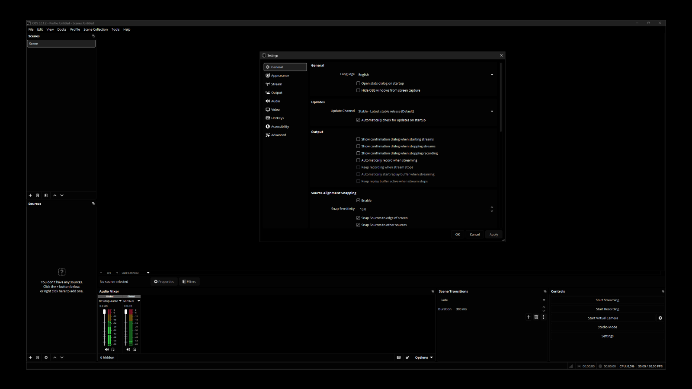

# Void

## Installation

1. Download [`Void.obt`](Void.obt).
2. Copy it into your OBS themes directory.
3. Open `OBS > Settings > Appearance`.
4. Select `Void` in the `Theme` dropdown.

## Theme Directory

You may need to create the `themes` folder if it does not exist.

- Windows:
  - Standard OBS install: `%AppData%\obs-studio\themes`
  - Portable OBS install: `<your OBS folder>\data\obs-studio\themes`
- macOS:
  - `~/Library/Application Support/obs-studio/themes`
- Linux:
  - Native install: `~/.config/obs-studio/themes`
  - Flatpak install: `~/.var/app/com.obsproject.Studio/config/obs-studio/themes`
